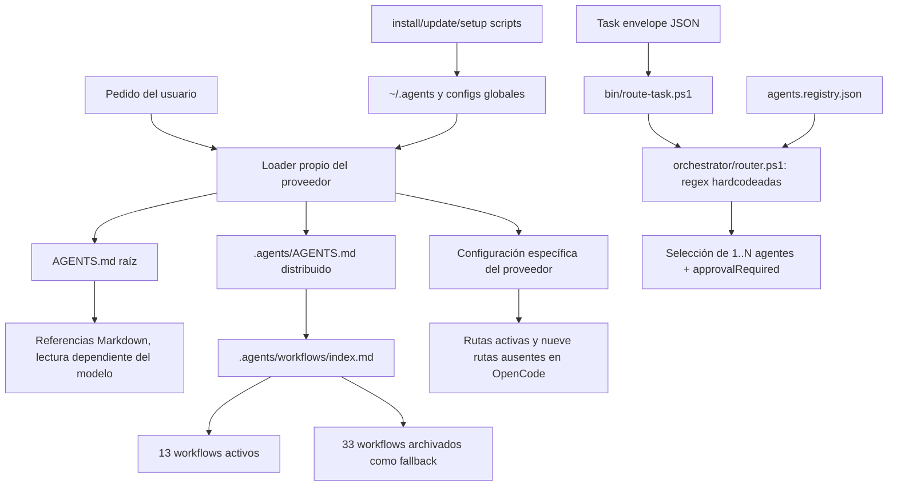

# Mapa del sistema actual

## Resumen verificable

- Base: `2a2745127fbc507d6cc53515ae03bdf0cd14abf1` (`origin/main`, 2026-06-27).
- Inventario Git: 667 entradas: 666 blobs y un gitlink `160000`.
- Tamaño físico observado: 666 archivos, aproximadamente 11,28 MB y 175.318 líneas contadas como texto.
- `.agents/`: 606 archivos físicos y el gitlink; concentra aproximadamente 97,5% de los bytes.
- Activo: 19 agentes, 13 workflows y 52 skills estándar con `SKILL.md`.
- Archivo: 33 workflows y 27 skills; 434 archivos en total al incluir assets, ejemplos, scripts y schemas vendorizados.
- Estado especial: `.agents/skills/obsidian-skills` es un gitlink vacío sin `.gitmodules`; no es reproducible desde este repo.

Los conteos de líneas incluyen formatos que `Get-Content` interpreta como texto; no representan tokens exactos. Los hashes y el inventario provienen de Git, no de la documentación.

## Arquitectura documentada

La arquitectura declarada es:

```text
chat natural
→ start.md
→ index.md
→ phases.md si la tarea no es trivial
→ workflow mínimo
→ agente o skill
→ tools
→ validation.md
→ feedback/checkpoint/memoria
```

Fuentes: `docs/world-class-workflow.md`, `docs/architecture.md`, `README.md` y `AGENTS.md`.

El modelo conceptual de cinco capas —input, model, memory, tools y output— es razonable, pero la implementación no materializa varias de esas transiciones. `phases.md` no existe; `feedback_loop.md` está archivado; no hay un runtime que ejecute automáticamente `start.md` o el router Markdown; y el router PowerShell es una ruta paralela distinta.

## Arquitectura realmente implementada



Hay dos planos que no se integran:

1. El plano prompt/documental: entry points del proveedor → `AGENTS.md` → referencias a rules/workflows/skills.
2. El plano machine-readable: task JSON → `route-task.ps1` → regex de `router.ps1` → registry.

El segundo no llama workflows ni skills, no carga memoria, no ejecuta agentes y no valida el task contra `task.schema.json`. Solo produce una decisión JSON.

## Entry points reales

| Superficie | Entry point observado | Qué carga realmente | Problema |
|---|---|---|---|
| Codex | `AGENTS.md` por convención | Cadena global + raíz + archivos anidados aplicables | No carga `.agents/AGENTS.md` ni referencias transitivas automáticamente. |
| Claude Code | `CLAUDE.md` | El contenido literal de `CLAUDE.md` | Dice “leé AGENTS.md”, pero no usa el import nativo `@AGENTS.md`. |
| OpenCode | `opencode.json` raíz y config global copiada | El CLI 1.17.9 rechaza `version` y `agents`; no abre el repo | Bloqueo antes de llegar al sistema. |
| OpenCode global | `config/opencode/opencode.jsonc` copiado a `~/.config/opencode/` | Lista `instructions` de 26 rutas: 17 existen y 9 no están activas | Carga ansiosa, drift y rutas rotas. |
| Gemini/Antigravity | `GEMINI.md` y `.gemini/settings.json` | `context.fileName = AGENTS.md` está configurado | La migración de skills a `.agents/skills` no está demostrada. |
| Cursor | `.cursorrules` | Mecanismo legacy por repo | User Rules actuales viven en Settings; `~/.cursorrules` no es el contrato global vigente. |
| Aider | `.aider.conf.yml` | `AGENTS.md` raíz vía `read` | Consume la versión larga, no la fuente declarada `.agents/AGENTS.md`. |
| GitHub Copilot | `.github/copilot-instructions.md` | Instrucción de leer `.agents/AGENTS.md` | La segunda lectura depende del agente. |
| Zed | `.zed/settings.json` | Declara `load_agent_rules` | El setup global queda manual; no se verificó runtime. |
| CLI de routing | `bin/route-task.ps1` | Task JSON + registry + regex | No aplica schema ni workflows. |
| Instalación | `install.ps1`, `install.sh` | Clona y enlaza/copia `.agents`, `bin`, config OpenCode | Windows y Unix no producen el mismo resultado. |
| Actualización | `update.ps1`, `update.sh`, `bin/update-system.ps1`, `bin/sync-agents.ps1` | Distintas combinaciones de pull/copia/symlink | Varias fuentes de verdad y borrado de copias globales. |

## Precedencia: documentada versus efectiva

| Tema | Documentación | Efecto observable |
|---|---|---|
| Fuente global | `.agents/AGENTS.md` es “única fuente de verdad” (`docs/multi-ide-setup.md:7`) | Codex/Aider/Claude parten del `AGENTS.md` raíz; setup distribuye `.agents/AGENTS.md`; sync puede sobrescribirla con la raíz. |
| Routing | `workflows/index.md` es canónico (`AGENTS.md:29-30`) | El router PowerShell no consulta `index.md`; usa regex propias. |
| Precedencia interna | `docs/world-class-workflow.md:16-29` ubica `.agents/AGENTS.md` arriba del index y docs | El `AGENTS.md` raíz declara otra relación y contiene más mandatos. |
| Skills | `skills_routing.md` cataloga skills core/especializadas | Codex descubre directorios `SKILL.md` por metadatos; el catálogo omite 24 skills activas y nombra skills no activas. |
| Agentes | Registry + prompts son contrato | Registry valida forma; prompts, tools y outputs pueden contradecirse sin error. |
| Aprobación | Registry trae `requiresApproval` por agente | Rules y plataformas aprueban por acción/riesgo; el principal requiere aprobación para cualquier tarea, incluso trivial. |

## Fuentes de verdad accidentales

1. `AGENTS.md` raíz: 14.509 caracteres, aproximadamente 3.627 tokens por regla `caracteres/4`.
2. `.agents/AGENTS.md`: 6.061 caracteres, aproximadamente 1.515 tokens; hash distinto.
3. `.agents/workflows/index.md`: router humano de 43 líneas.
4. `orchestrator/router.ps1`: router machine-readable de 159 líneas con taxonomía distinta.
5. `agents.registry.json`: metadata de 19 agentes, no usada para matching semántico.
6. `config/opencode/opencode.jsonc`: lista propia de 26 instrucciones.
7. README y docs: describen rutas previas a la poda de `d0edbbb`.
8. `.agents/.skill-lock.json`: 57 entradas, mezclando 35 skills activas, 21 archivadas y una ruta que no coincide.

## Carga de contexto

Estimaciones simples basadas en caracteres/4; no equivalen a tokenización de un modelo concreto.

| Conjunto | Archivos | Caracteres | Tokens estimados |
|---|---:|---:|---:|
| `AGENTS.md` raíz | 1 | 14.509 | 3.627 |
| `.agents/AGENTS.md` | 1 | 6.061 | 1.515 |
| Rules activas | 9 | 16.640 | 4.160 |
| `index.md` | 1 | 2.119 | 530 |
| `start.md` | 1 | 2.733 | 683 |
| `validation.md` | 1 | 5.166 | 1.292 |
| Prompts de 19 agentes | 19 | 51.638 | 12.910 |
| 52 `SKILL.md` completos | 52 | 336.275 | 84.069 |
| Set OpenCode que existe | 17 | 51.958 | 12.990 |

Codex no carga las 52 skills completas: usa progressive disclosure y empieza con nombre/descripción/path. El problema es el volumen y solapamiento del catálogo inicial, no 84K tokens siempre cargados. OpenCode, en cambio, declara 26 archivos en `instructions`; 17 existentes suman cerca de 13K tokens y nueve rutas fallan o quedaron archivadas.

## Routing machine-readable

`orchestrator/router.ps1`:

- ignora `registry.whenToUse`;
- concatena title/body/labels;
- selecciona por regex inglesas;
- una mención explícita impide evaluar todas las reglas semánticas;
- agrega reviewer a cualquier texto que matchee `implement|fix|bug|feature|api|database|backend|frontend|script`;
- convierte `requiresApproval` de cualquier agente elegido en aprobación global.

Solo 12 de 19 agentes tienen una ruta semántica. No hay ruta natural para tutor, Obsidian, marketing, X content, SEO técnico, kickoff o pruner. El regex `pr` no tiene límites de palabra y captura palabras como “preparación” y “producto”.

## Instalación, actualización y sincronización

### Windows

`install.ps1` clona en `~/agents-system`, decide symlink solo por privilegio de administrador, copia OpenCode y ejecuta `setup-ide-pointers.ps1`. `bin/update-system.ps1` usa otra detección de symlink, puede borrar `~/.agents` recursivamente y luego recrearlo. `update.ps1` implementa otro camino de copia.

### Unix

`install.sh` enlaza `.agents` y `bin` y copia solo OpenCode. No hay equivalente a `setup-ide-pointers.ps1`; `update.sh` tampoco resincroniza otros IDEs. El comando documentado `ln AGENTS.md CLAUDE.md` crea hard link, no symlink.

### Drift

- `bin/sync-agents.ps1` conserva una ruta personal `CascadeProjects\cv-palmeri\agents-system` y copia `AGENTS.md` raíz sobre `.agents/AGENTS.md`.
- Los modos copia pueden borrar contenido local no versionado sin backup.
- `config/opencode/package-lock.json` no tiene `package.json` compañero.
- `opencode.json` raíz no es el archivo que los instaladores distribuyen.

## Memoria y checkpoints

La memoria es Markdown manual:

- `.agents/tasks/lessons.md`: tres lecciones locales.
- `.agents/memory/lessons-global.md`: memoria durable.
- `.agents/tasks/handoff.md`, `tech-debt.md`, `decisions.md`, `usage-log.md`.
- `session_checkpoint.md`: plantilla manual.

No hay instrumentación que demuestre cuándo se leyó o aplicó una memoria. `start.md` obliga a consultar hasta ocho artefactos y después esperar otra instrucción, aunque falten; esto contradice el fallback no bloqueante y agrega fricción a tareas triviales.

## Validación real y puntos de sincronización

| Check | Resultado observado | Cobertura real |
|---|---|---|
| `validate-agents.ps1` | exit 0, 19 agentes | Campos/enums básicos, existencia y `name`; no aplica JSON Schema ni semántica. |
| `test-system.ps1 -AgentsRoot .\.agents` | exit 0, 0 warnings | Un subconjunto de refs con backticks en un único AGENTS, tamaño de workflows y frontmatter superficial. |
| `test-system.ps1` default | exit 1 | Valida la copia instalada, no el checkout. |
| `check-agents-system.ps1` | reporta 21 faltantes pero exit 0 | Lista hardcodeada stale; no es gate. |
| `release-check.ps1` | exit 1 solo por identidad Git | Parse, required files, secret scan y smoke router; no detecta la arquitectura rota. |
| CI | solo `validate-agents.ps1` | Puede quedar verde con routing/docs/config rotos. |
| `opencode debug config` | exit 1 | Detecta el bloqueo que ningún check local cubre. |

## Comportamiento ante faltantes

- Prompt: `start.md` dice reportar y continuar, pero termina con “esperar instrucción”.
- Router: cae a `agente-principal`, que por registry exige aprobación.
- Skills: un directorio sin `SKILL.md` no es usable; el validador tolera hasta 50% vacías.
- Gitlink: no hay URL para recuperarlo.
- OpenCode: configuración inválida bloquea el CLI; instrucciones faltantes no tienen fallback probado.
- Instaladores: copian lo que existe y pueden perpetuar una versión stale.

## Inventario exacto

La lista siguiente se generó con `git ls-files` sobre la base auditada y contiene exactamente los 667 entries. “Inspeccionado” no significa lectura manual línea por línea de cada vendored schema: el método real fue corpus search + revisión semántica dirigida para texto, parser/syntax check por familia y metadata/hash para binarios. Esta distinción evita exagerar la evidencia.

| Método efectivo | Entries |
|---|---:|
| Texto/otros: corpus search + revisión semántica dirigida | 371 |
| PowerShell: texto completo + parser | 17 |
| Shell: texto completo + `bash -n` | 19 |
| Python: corpus + AST | 62 |
| JavaScript: corpus + `node --check` | 4 |
| JSON/JSONC: texto + parse para JSON estricto | 15 |
| XML/XSD: parser + path/hash | 122 |
| Binarios TTF/GZ: path/tamaño/SHA-256, sin interpretación de contenido | 55 |
| PDF: texto/metadata con pypdf; fidelidad visual no verificada | 1 |
| Gitlink: index/tree/submodule metadata; contenido no recuperable | 1 |

El PDF produjo 10 páginas y 4.306 caracteres extraídos; el render falló por el wrapper Poppler y ausencia de PyMuPDF. Para cada path, el método aplicable se determina de forma no ambigua por tipo en esta tabla; los límites binarios, PDF y gitlink quedan explícitos.

<!-- INVENTORY_START -->
```text
.agents/.skill-lock.json
.agents/AGENTS.md
.agents/SKILL.md
.agents/agents/agente-academic-tutor.md
.agents/agents/agente-ai-architect.md
.agents/agents/agente-code-reviewer.md
.agents/agents/agente-design.md
.agents/agents/agente-docs.md
.agents/agents/agente-growth-seo-geo.md
.agents/agents/agente-marketing-strategist.md
.agents/agents/agente-mcp-architect.md
.agents/agents/agente-obsidian-brain.md
.agents/agents/agente-principal.md
.agents/agents/agente-product-founder.md
.agents/agents/agente-release-manager.md
.agents/agents/agente-researcher.md
.agents/agents/agente-security-auditor.md
.agents/agents/agente-seo.md
.agents/agents/agente-tests.md
.agents/agents/agente-x-content-strategist.md
.agents/agents/kickoff-architect.md
.agents/agents/workflow-pruner.md
.agents/archive/skills/agent-development/SKILL.md
.agents/archive/skills/agent-development/examples/agent-creation-prompt.md
.agents/archive/skills/agent-development/examples/complete-agent-examples.md
.agents/archive/skills/agent-development/references/agent-creation-system-prompt.md
.agents/archive/skills/agent-development/references/system-prompt-design.md
.agents/archive/skills/agent-development/references/triggering-examples.md
.agents/archive/skills/agent-development/scripts/validate-agent.sh
.agents/archive/skills/algorithmic-art/LICENSE.txt
.agents/archive/skills/algorithmic-art/SKILL.md
.agents/archive/skills/algorithmic-art/templates/generator_template.js
.agents/archive/skills/algorithmic-art/templates/viewer.html
.agents/archive/skills/beui/SKILL.md
.agents/archive/skills/brand-guidelines/LICENSE.txt
.agents/archive/skills/brand-guidelines/SKILL.md
.agents/archive/skills/canvas-design/LICENSE.txt
.agents/archive/skills/canvas-design/SKILL.md
.agents/archive/skills/canvas-design/canvas-fonts/ArsenalSC-OFL.txt
.agents/archive/skills/canvas-design/canvas-fonts/ArsenalSC-Regular.ttf
.agents/archive/skills/canvas-design/canvas-fonts/BigShoulders-Bold.ttf
.agents/archive/skills/canvas-design/canvas-fonts/BigShoulders-OFL.txt
.agents/archive/skills/canvas-design/canvas-fonts/BigShoulders-Regular.ttf
.agents/archive/skills/canvas-design/canvas-fonts/Boldonse-OFL.txt
.agents/archive/skills/canvas-design/canvas-fonts/Boldonse-Regular.ttf
.agents/archive/skills/canvas-design/canvas-fonts/BricolageGrotesque-Bold.ttf
.agents/archive/skills/canvas-design/canvas-fonts/BricolageGrotesque-OFL.txt
.agents/archive/skills/canvas-design/canvas-fonts/BricolageGrotesque-Regular.ttf
.agents/archive/skills/canvas-design/canvas-fonts/CrimsonPro-Bold.ttf
.agents/archive/skills/canvas-design/canvas-fonts/CrimsonPro-Italic.ttf
.agents/archive/skills/canvas-design/canvas-fonts/CrimsonPro-OFL.txt
.agents/archive/skills/canvas-design/canvas-fonts/CrimsonPro-Regular.ttf
.agents/archive/skills/canvas-design/canvas-fonts/DMMono-OFL.txt
.agents/archive/skills/canvas-design/canvas-fonts/DMMono-Regular.ttf
.agents/archive/skills/canvas-design/canvas-fonts/EricaOne-OFL.txt
.agents/archive/skills/canvas-design/canvas-fonts/EricaOne-Regular.ttf
.agents/archive/skills/canvas-design/canvas-fonts/GeistMono-Bold.ttf
.agents/archive/skills/canvas-design/canvas-fonts/GeistMono-OFL.txt
.agents/archive/skills/canvas-design/canvas-fonts/GeistMono-Regular.ttf
.agents/archive/skills/canvas-design/canvas-fonts/Gloock-OFL.txt
.agents/archive/skills/canvas-design/canvas-fonts/Gloock-Regular.ttf
.agents/archive/skills/canvas-design/canvas-fonts/IBMPlexMono-Bold.ttf
.agents/archive/skills/canvas-design/canvas-fonts/IBMPlexMono-OFL.txt
.agents/archive/skills/canvas-design/canvas-fonts/IBMPlexMono-Regular.ttf
.agents/archive/skills/canvas-design/canvas-fonts/IBMPlexSerif-Bold.ttf
.agents/archive/skills/canvas-design/canvas-fonts/IBMPlexSerif-BoldItalic.ttf
.agents/archive/skills/canvas-design/canvas-fonts/IBMPlexSerif-Italic.ttf
.agents/archive/skills/canvas-design/canvas-fonts/IBMPlexSerif-Regular.ttf
.agents/archive/skills/canvas-design/canvas-fonts/InstrumentSans-Bold.ttf
.agents/archive/skills/canvas-design/canvas-fonts/InstrumentSans-BoldItalic.ttf
.agents/archive/skills/canvas-design/canvas-fonts/InstrumentSans-Italic.ttf
.agents/archive/skills/canvas-design/canvas-fonts/InstrumentSans-OFL.txt
.agents/archive/skills/canvas-design/canvas-fonts/InstrumentSans-Regular.ttf
.agents/archive/skills/canvas-design/canvas-fonts/InstrumentSerif-Italic.ttf
.agents/archive/skills/canvas-design/canvas-fonts/InstrumentSerif-Regular.ttf
.agents/archive/skills/canvas-design/canvas-fonts/Italiana-OFL.txt
.agents/archive/skills/canvas-design/canvas-fonts/Italiana-Regular.ttf
.agents/archive/skills/canvas-design/canvas-fonts/JetBrainsMono-Bold.ttf
.agents/archive/skills/canvas-design/canvas-fonts/JetBrainsMono-OFL.txt
.agents/archive/skills/canvas-design/canvas-fonts/JetBrainsMono-Regular.ttf
.agents/archive/skills/canvas-design/canvas-fonts/Jura-Light.ttf
.agents/archive/skills/canvas-design/canvas-fonts/Jura-Medium.ttf
.agents/archive/skills/canvas-design/canvas-fonts/Jura-OFL.txt
.agents/archive/skills/canvas-design/canvas-fonts/LibreBaskerville-OFL.txt
.agents/archive/skills/canvas-design/canvas-fonts/LibreBaskerville-Regular.ttf
.agents/archive/skills/canvas-design/canvas-fonts/Lora-Bold.ttf
.agents/archive/skills/canvas-design/canvas-fonts/Lora-BoldItalic.ttf
.agents/archive/skills/canvas-design/canvas-fonts/Lora-Italic.ttf
.agents/archive/skills/canvas-design/canvas-fonts/Lora-OFL.txt
.agents/archive/skills/canvas-design/canvas-fonts/Lora-Regular.ttf
.agents/archive/skills/canvas-design/canvas-fonts/NationalPark-Bold.ttf
.agents/archive/skills/canvas-design/canvas-fonts/NationalPark-OFL.txt
.agents/archive/skills/canvas-design/canvas-fonts/NationalPark-Regular.ttf
.agents/archive/skills/canvas-design/canvas-fonts/NothingYouCouldDo-OFL.txt
.agents/archive/skills/canvas-design/canvas-fonts/NothingYouCouldDo-Regular.ttf
.agents/archive/skills/canvas-design/canvas-fonts/Outfit-Bold.ttf
.agents/archive/skills/canvas-design/canvas-fonts/Outfit-OFL.txt
.agents/archive/skills/canvas-design/canvas-fonts/Outfit-Regular.ttf
.agents/archive/skills/canvas-design/canvas-fonts/PixelifySans-Medium.ttf
.agents/archive/skills/canvas-design/canvas-fonts/PixelifySans-OFL.txt
.agents/archive/skills/canvas-design/canvas-fonts/PoiretOne-OFL.txt
.agents/archive/skills/canvas-design/canvas-fonts/PoiretOne-Regular.ttf
.agents/archive/skills/canvas-design/canvas-fonts/RedHatMono-Bold.ttf
.agents/archive/skills/canvas-design/canvas-fonts/RedHatMono-OFL.txt
.agents/archive/skills/canvas-design/canvas-fonts/RedHatMono-Regular.ttf
.agents/archive/skills/canvas-design/canvas-fonts/Silkscreen-OFL.txt
.agents/archive/skills/canvas-design/canvas-fonts/Silkscreen-Regular.ttf
.agents/archive/skills/canvas-design/canvas-fonts/SmoochSans-Medium.ttf
.agents/archive/skills/canvas-design/canvas-fonts/SmoochSans-OFL.txt
.agents/archive/skills/canvas-design/canvas-fonts/Tektur-Medium.ttf
.agents/archive/skills/canvas-design/canvas-fonts/Tektur-OFL.txt
.agents/archive/skills/canvas-design/canvas-fonts/Tektur-Regular.ttf
.agents/archive/skills/canvas-design/canvas-fonts/WorkSans-Bold.ttf
.agents/archive/skills/canvas-design/canvas-fonts/WorkSans-BoldItalic.ttf
.agents/archive/skills/canvas-design/canvas-fonts/WorkSans-Italic.ttf
.agents/archive/skills/canvas-design/canvas-fonts/WorkSans-OFL.txt
.agents/archive/skills/canvas-design/canvas-fonts/WorkSans-Regular.ttf
.agents/archive/skills/canvas-design/canvas-fonts/YoungSerif-OFL.txt
.agents/archive/skills/canvas-design/canvas-fonts/YoungSerif-Regular.ttf
.agents/archive/skills/claude-opus-4-5-migration/SKILL.md
.agents/archive/skills/claude-opus-4-5-migration/references/effort.md
.agents/archive/skills/claude-opus-4-5-migration/references/prompt-snippets.md
.agents/archive/skills/cli-essentials/SKILL.md
.agents/archive/skills/command-development/README.md
.agents/archive/skills/command-development/SKILL.md
.agents/archive/skills/command-development/examples/plugin-commands.md
.agents/archive/skills/command-development/examples/simple-commands.md
.agents/archive/skills/command-development/references/advanced-workflows.md
.agents/archive/skills/command-development/references/documentation-patterns.md
.agents/archive/skills/command-development/references/frontmatter-reference.md
.agents/archive/skills/command-development/references/interactive-commands.md
.agents/archive/skills/command-development/references/marketplace-considerations.md
.agents/archive/skills/command-development/references/plugin-features-reference.md
.agents/archive/skills/command-development/references/testing-strategies.md
.agents/archive/skills/docx/LICENSE.txt
.agents/archive/skills/docx/SKILL.md
.agents/archive/skills/docx/scripts/__init__.py
.agents/archive/skills/docx/scripts/accept_changes.py
.agents/archive/skills/docx/scripts/comment.py
.agents/archive/skills/docx/scripts/office/helpers/__init__.py
.agents/archive/skills/docx/scripts/office/helpers/merge_runs.py
.agents/archive/skills/docx/scripts/office/helpers/simplify_redlines.py
.agents/archive/skills/docx/scripts/office/pack.py
.agents/archive/skills/docx/scripts/office/schemas/ISO-IEC29500-4_2016/dml-chart.xsd
.agents/archive/skills/docx/scripts/office/schemas/ISO-IEC29500-4_2016/dml-chartDrawing.xsd
.agents/archive/skills/docx/scripts/office/schemas/ISO-IEC29500-4_2016/dml-diagram.xsd
.agents/archive/skills/docx/scripts/office/schemas/ISO-IEC29500-4_2016/dml-lockedCanvas.xsd
.agents/archive/skills/docx/scripts/office/schemas/ISO-IEC29500-4_2016/dml-main.xsd
.agents/archive/skills/docx/scripts/office/schemas/ISO-IEC29500-4_2016/dml-picture.xsd
.agents/archive/skills/docx/scripts/office/schemas/ISO-IEC29500-4_2016/dml-spreadsheetDrawing.xsd
.agents/archive/skills/docx/scripts/office/schemas/ISO-IEC29500-4_2016/dml-wordprocessingDrawing.xsd
.agents/archive/skills/docx/scripts/office/schemas/ISO-IEC29500-4_2016/pml.xsd
.agents/archive/skills/docx/scripts/office/schemas/ISO-IEC29500-4_2016/shared-additionalCharacteristics.xsd
.agents/archive/skills/docx/scripts/office/schemas/ISO-IEC29500-4_2016/shared-bibliography.xsd
.agents/archive/skills/docx/scripts/office/schemas/ISO-IEC29500-4_2016/shared-commonSimpleTypes.xsd
.agents/archive/skills/docx/scripts/office/schemas/ISO-IEC29500-4_2016/shared-customXmlDataProperties.xsd
.agents/archive/skills/docx/scripts/office/schemas/ISO-IEC29500-4_2016/shared-customXmlSchemaProperties.xsd
.agents/archive/skills/docx/scripts/office/schemas/ISO-IEC29500-4_2016/shared-documentPropertiesCustom.xsd
.agents/archive/skills/docx/scripts/office/schemas/ISO-IEC29500-4_2016/shared-documentPropertiesExtended.xsd
.agents/archive/skills/docx/scripts/office/schemas/ISO-IEC29500-4_2016/shared-documentPropertiesVariantTypes.xsd
.agents/archive/skills/docx/scripts/office/schemas/ISO-IEC29500-4_2016/shared-math.xsd
.agents/archive/skills/docx/scripts/office/schemas/ISO-IEC29500-4_2016/shared-relationshipReference.xsd
.agents/archive/skills/docx/scripts/office/schemas/ISO-IEC29500-4_2016/sml.xsd
.agents/archive/skills/docx/scripts/office/schemas/ISO-IEC29500-4_2016/vml-main.xsd
.agents/archive/skills/docx/scripts/office/schemas/ISO-IEC29500-4_2016/vml-officeDrawing.xsd
.agents/archive/skills/docx/scripts/office/schemas/ISO-IEC29500-4_2016/vml-presentationDrawing.xsd
.agents/archive/skills/docx/scripts/office/schemas/ISO-IEC29500-4_2016/vml-spreadsheetDrawing.xsd
.agents/archive/skills/docx/scripts/office/schemas/ISO-IEC29500-4_2016/vml-wordprocessingDrawing.xsd
.agents/archive/skills/docx/scripts/office/schemas/ISO-IEC29500-4_2016/wml.xsd
.agents/archive/skills/docx/scripts/office/schemas/ISO-IEC29500-4_2016/xml.xsd
.agents/archive/skills/docx/scripts/office/schemas/ecma/fouth-edition/opc-contentTypes.xsd
.agents/archive/skills/docx/scripts/office/schemas/ecma/fouth-edition/opc-coreProperties.xsd
.agents/archive/skills/docx/scripts/office/schemas/ecma/fouth-edition/opc-digSig.xsd
.agents/archive/skills/docx/scripts/office/schemas/ecma/fouth-edition/opc-relationships.xsd
.agents/archive/skills/docx/scripts/office/schemas/mce/mc.xsd
.agents/archive/skills/docx/scripts/office/schemas/microsoft/wml-2010.xsd
.agents/archive/skills/docx/scripts/office/schemas/microsoft/wml-2012.xsd
.agents/archive/skills/docx/scripts/office/schemas/microsoft/wml-2018.xsd
.agents/archive/skills/docx/scripts/office/schemas/microsoft/wml-cex-2018.xsd
.agents/archive/skills/docx/scripts/office/schemas/microsoft/wml-cid-2016.xsd
.agents/archive/skills/docx/scripts/office/schemas/microsoft/wml-sdtdatahash-2020.xsd
.agents/archive/skills/docx/scripts/office/schemas/microsoft/wml-symex-2015.xsd
.agents/archive/skills/docx/scripts/office/soffice.py
.agents/archive/skills/docx/scripts/office/unpack.py
.agents/archive/skills/docx/scripts/office/validate.py
.agents/archive/skills/docx/scripts/office/validators/__init__.py
.agents/archive/skills/docx/scripts/office/validators/base.py
.agents/archive/skills/docx/scripts/office/validators/docx.py
.agents/archive/skills/docx/scripts/office/validators/pptx.py
.agents/archive/skills/docx/scripts/office/validators/redlining.py
.agents/archive/skills/docx/scripts/templates/comments.xml
.agents/archive/skills/docx/scripts/templates/commentsExtended.xml
.agents/archive/skills/docx/scripts/templates/commentsExtensible.xml
.agents/archive/skills/docx/scripts/templates/commentsIds.xml
.agents/archive/skills/docx/scripts/templates/people.xml
.agents/archive/skills/hook-development/SKILL.md
.agents/archive/skills/hook-development/examples/load-context.sh
.agents/archive/skills/hook-development/examples/validate-bash.sh
.agents/archive/skills/hook-development/examples/validate-write.sh
.agents/archive/skills/hook-development/references/advanced.md
.agents/archive/skills/hook-development/references/migration.md
.agents/archive/skills/hook-development/references/patterns.md
.agents/archive/skills/hook-development/scripts/README.md
.agents/archive/skills/hook-development/scripts/hook-linter.sh
.agents/archive/skills/hook-development/scripts/test-hook.sh
.agents/archive/skills/hook-development/scripts/validate-hook-schema.sh
.agents/archive/skills/html-vanilla/SKILL.md
.agents/archive/skills/internal-comms/LICENSE.txt
.agents/archive/skills/internal-comms/SKILL.md
.agents/archive/skills/internal-comms/examples/3p-updates.md
.agents/archive/skills/internal-comms/examples/company-newsletter.md
.agents/archive/skills/internal-comms/examples/faq-answers.md
.agents/archive/skills/internal-comms/examples/general-comms.md
.agents/archive/skills/mcp-integration/SKILL.md
.agents/archive/skills/mcp-integration/examples/http-server.json
.agents/archive/skills/mcp-integration/examples/sse-server.json
.agents/archive/skills/mcp-integration/examples/stdio-server.json
.agents/archive/skills/mcp-integration/references/authentication.md
.agents/archive/skills/mcp-integration/references/server-types.md
.agents/archive/skills/mcp-integration/references/tool-usage.md
.agents/archive/skills/plugin-settings/SKILL.md
.agents/archive/skills/plugin-settings/examples/create-settings-command.md
.agents/archive/skills/plugin-settings/examples/example-settings.md
.agents/archive/skills/plugin-settings/examples/read-settings-hook.sh
.agents/archive/skills/plugin-settings/references/parsing-techniques.md
.agents/archive/skills/plugin-settings/references/real-world-examples.md
.agents/archive/skills/plugin-settings/scripts/parse-frontmatter.sh
.agents/archive/skills/plugin-settings/scripts/validate-settings.sh
.agents/archive/skills/plugin-structure/README.md
.agents/archive/skills/plugin-structure/SKILL.md
.agents/archive/skills/plugin-structure/examples/advanced-plugin.md
.agents/archive/skills/plugin-structure/examples/minimal-plugin.md
.agents/archive/skills/plugin-structure/examples/standard-plugin.md
.agents/archive/skills/plugin-structure/references/component-patterns.md
.agents/archive/skills/plugin-structure/references/manifest-reference.md
.agents/archive/skills/pptx/LICENSE.txt
.agents/archive/skills/pptx/SKILL.md
.agents/archive/skills/pptx/editing.md
.agents/archive/skills/pptx/pptxgenjs.md
.agents/archive/skills/pptx/scripts/__init__.py
.agents/archive/skills/pptx/scripts/add_slide.py
.agents/archive/skills/pptx/scripts/clean.py
.agents/archive/skills/pptx/scripts/office/helpers/__init__.py
.agents/archive/skills/pptx/scripts/office/helpers/merge_runs.py
.agents/archive/skills/pptx/scripts/office/helpers/simplify_redlines.py
.agents/archive/skills/pptx/scripts/office/pack.py
.agents/archive/skills/pptx/scripts/office/schemas/ISO-IEC29500-4_2016/dml-chart.xsd
.agents/archive/skills/pptx/scripts/office/schemas/ISO-IEC29500-4_2016/dml-chartDrawing.xsd
.agents/archive/skills/pptx/scripts/office/schemas/ISO-IEC29500-4_2016/dml-diagram.xsd
.agents/archive/skills/pptx/scripts/office/schemas/ISO-IEC29500-4_2016/dml-lockedCanvas.xsd
.agents/archive/skills/pptx/scripts/office/schemas/ISO-IEC29500-4_2016/dml-main.xsd
.agents/archive/skills/pptx/scripts/office/schemas/ISO-IEC29500-4_2016/dml-picture.xsd
.agents/archive/skills/pptx/scripts/office/schemas/ISO-IEC29500-4_2016/dml-spreadsheetDrawing.xsd
.agents/archive/skills/pptx/scripts/office/schemas/ISO-IEC29500-4_2016/dml-wordprocessingDrawing.xsd
.agents/archive/skills/pptx/scripts/office/schemas/ISO-IEC29500-4_2016/pml.xsd
.agents/archive/skills/pptx/scripts/office/schemas/ISO-IEC29500-4_2016/shared-additionalCharacteristics.xsd
.agents/archive/skills/pptx/scripts/office/schemas/ISO-IEC29500-4_2016/shared-bibliography.xsd
.agents/archive/skills/pptx/scripts/office/schemas/ISO-IEC29500-4_2016/shared-commonSimpleTypes.xsd
.agents/archive/skills/pptx/scripts/office/schemas/ISO-IEC29500-4_2016/shared-customXmlDataProperties.xsd
.agents/archive/skills/pptx/scripts/office/schemas/ISO-IEC29500-4_2016/shared-customXmlSchemaProperties.xsd
.agents/archive/skills/pptx/scripts/office/schemas/ISO-IEC29500-4_2016/shared-documentPropertiesCustom.xsd
.agents/archive/skills/pptx/scripts/office/schemas/ISO-IEC29500-4_2016/shared-documentPropertiesExtended.xsd
.agents/archive/skills/pptx/scripts/office/schemas/ISO-IEC29500-4_2016/shared-documentPropertiesVariantTypes.xsd
.agents/archive/skills/pptx/scripts/office/schemas/ISO-IEC29500-4_2016/shared-math.xsd
.agents/archive/skills/pptx/scripts/office/schemas/ISO-IEC29500-4_2016/shared-relationshipReference.xsd
.agents/archive/skills/pptx/scripts/office/schemas/ISO-IEC29500-4_2016/sml.xsd
.agents/archive/skills/pptx/scripts/office/schemas/ISO-IEC29500-4_2016/vml-main.xsd
.agents/archive/skills/pptx/scripts/office/schemas/ISO-IEC29500-4_2016/vml-officeDrawing.xsd
.agents/archive/skills/pptx/scripts/office/schemas/ISO-IEC29500-4_2016/vml-presentationDrawing.xsd
.agents/archive/skills/pptx/scripts/office/schemas/ISO-IEC29500-4_2016/vml-spreadsheetDrawing.xsd
.agents/archive/skills/pptx/scripts/office/schemas/ISO-IEC29500-4_2016/vml-wordprocessingDrawing.xsd
.agents/archive/skills/pptx/scripts/office/schemas/ISO-IEC29500-4_2016/wml.xsd
.agents/archive/skills/pptx/scripts/office/schemas/ISO-IEC29500-4_2016/xml.xsd
.agents/archive/skills/pptx/scripts/office/schemas/ecma/fouth-edition/opc-contentTypes.xsd
.agents/archive/skills/pptx/scripts/office/schemas/ecma/fouth-edition/opc-coreProperties.xsd
.agents/archive/skills/pptx/scripts/office/schemas/ecma/fouth-edition/opc-digSig.xsd
.agents/archive/skills/pptx/scripts/office/schemas/ecma/fouth-edition/opc-relationships.xsd
.agents/archive/skills/pptx/scripts/office/schemas/mce/mc.xsd
.agents/archive/skills/pptx/scripts/office/schemas/microsoft/wml-2010.xsd
.agents/archive/skills/pptx/scripts/office/schemas/microsoft/wml-2012.xsd
.agents/archive/skills/pptx/scripts/office/schemas/microsoft/wml-2018.xsd
.agents/archive/skills/pptx/scripts/office/schemas/microsoft/wml-cex-2018.xsd
.agents/archive/skills/pptx/scripts/office/schemas/microsoft/wml-cid-2016.xsd
.agents/archive/skills/pptx/scripts/office/schemas/microsoft/wml-sdtdatahash-2020.xsd
.agents/archive/skills/pptx/scripts/office/schemas/microsoft/wml-symex-2015.xsd
.agents/archive/skills/pptx/scripts/office/soffice.py
.agents/archive/skills/pptx/scripts/office/unpack.py
.agents/archive/skills/pptx/scripts/office/validate.py
.agents/archive/skills/pptx/scripts/office/validators/__init__.py
.agents/archive/skills/pptx/scripts/office/validators/base.py
.agents/archive/skills/pptx/scripts/office/validators/docx.py
.agents/archive/skills/pptx/scripts/office/validators/pptx.py
.agents/archive/skills/pptx/scripts/office/validators/redlining.py
.agents/archive/skills/pptx/scripts/thumbnail.py
.agents/archive/skills/premium-web-stack/SKILL.md
.agents/archive/skills/skill-development/SKILL.md
.agents/archive/skills/skill-development/references/skill-creator-original.md
.agents/archive/skills/slack-gif-creator/LICENSE.txt
.agents/archive/skills/slack-gif-creator/SKILL.md
.agents/archive/skills/slack-gif-creator/core/easing.py
.agents/archive/skills/slack-gif-creator/core/frame_composer.py
.agents/archive/skills/slack-gif-creator/core/gif_builder.py
.agents/archive/skills/slack-gif-creator/core/validators.py
.agents/archive/skills/slack-gif-creator/requirements.txt
.agents/archive/skills/supabase-postgres-best-practices/AGENTS.md
.agents/archive/skills/supabase-postgres-best-practices/CLAUDE.md
.agents/archive/skills/supabase-postgres-best-practices/README.md
.agents/archive/skills/supabase-postgres-best-practices/SKILL.md
.agents/archive/skills/supabase-postgres-best-practices/references/_contributing.md
.agents/archive/skills/supabase-postgres-best-practices/references/_sections.md
.agents/archive/skills/supabase-postgres-best-practices/references/_template.md
.agents/archive/skills/supabase-postgres-best-practices/references/advanced-full-text-search.md
.agents/archive/skills/supabase-postgres-best-practices/references/advanced-jsonb-indexing.md
.agents/archive/skills/supabase-postgres-best-practices/references/conn-idle-timeout.md
.agents/archive/skills/supabase-postgres-best-practices/references/conn-limits.md
.agents/archive/skills/supabase-postgres-best-practices/references/conn-pooling.md
.agents/archive/skills/supabase-postgres-best-practices/references/conn-prepared-statements.md
.agents/archive/skills/supabase-postgres-best-practices/references/data-batch-inserts.md
.agents/archive/skills/supabase-postgres-best-practices/references/data-n-plus-one.md
.agents/archive/skills/supabase-postgres-best-practices/references/data-pagination.md
.agents/archive/skills/supabase-postgres-best-practices/references/data-upsert.md
.agents/archive/skills/supabase-postgres-best-practices/references/lock-advisory.md
.agents/archive/skills/supabase-postgres-best-practices/references/lock-deadlock-prevention.md
.agents/archive/skills/supabase-postgres-best-practices/references/lock-short-transactions.md
.agents/archive/skills/supabase-postgres-best-practices/references/lock-skip-locked.md
.agents/archive/skills/supabase-postgres-best-practices/references/monitor-explain-analyze.md
.agents/archive/skills/supabase-postgres-best-practices/references/monitor-pg-stat-statements.md
.agents/archive/skills/supabase-postgres-best-practices/references/monitor-vacuum-analyze.md
.agents/archive/skills/supabase-postgres-best-practices/references/query-composite-indexes.md
.agents/archive/skills/supabase-postgres-best-practices/references/query-covering-indexes.md
.agents/archive/skills/supabase-postgres-best-practices/references/query-index-types.md
.agents/archive/skills/supabase-postgres-best-practices/references/query-missing-indexes.md
.agents/archive/skills/supabase-postgres-best-practices/references/query-partial-indexes.md
.agents/archive/skills/supabase-postgres-best-practices/references/schema-constraints.md
.agents/archive/skills/supabase-postgres-best-practices/references/schema-data-types.md
.agents/archive/skills/supabase-postgres-best-practices/references/schema-foreign-key-indexes.md
.agents/archive/skills/supabase-postgres-best-practices/references/schema-lowercase-identifiers.md
.agents/archive/skills/supabase-postgres-best-practices/references/schema-partitioning.md
.agents/archive/skills/supabase-postgres-best-practices/references/schema-primary-keys.md
.agents/archive/skills/supabase-postgres-best-practices/references/security-privileges.md
.agents/archive/skills/supabase-postgres-best-practices/references/security-rls-basics.md
.agents/archive/skills/supabase-postgres-best-practices/references/security-rls-performance.md
.agents/archive/skills/teach-impeccable/SKILL.md
.agents/archive/skills/theme-factory/LICENSE.txt
.agents/archive/skills/theme-factory/SKILL.md
.agents/archive/skills/theme-factory/theme-showcase.pdf
.agents/archive/skills/theme-factory/themes/arctic-frost.md
.agents/archive/skills/theme-factory/themes/botanical-garden.md
.agents/archive/skills/theme-factory/themes/desert-rose.md
.agents/archive/skills/theme-factory/themes/forest-canopy.md
.agents/archive/skills/theme-factory/themes/golden-hour.md
.agents/archive/skills/theme-factory/themes/midnight-galaxy.md
.agents/archive/skills/theme-factory/themes/modern-minimalist.md
.agents/archive/skills/theme-factory/themes/ocean-depths.md
.agents/archive/skills/theme-factory/themes/sunset-boulevard.md
.agents/archive/skills/theme-factory/themes/tech-innovation.md
.agents/archive/skills/web-artifacts-builder/LICENSE.txt
.agents/archive/skills/web-artifacts-builder/SKILL.md
.agents/archive/skills/web-artifacts-builder/scripts/bundle-artifact.sh
.agents/archive/skills/web-artifacts-builder/scripts/init-artifact.sh
.agents/archive/skills/web-artifacts-builder/scripts/shadcn-components.tar.gz
.agents/archive/skills/web-presentation-premium/SKILL.md
.agents/archive/skills/webapp-testing/LICENSE.txt
.agents/archive/skills/webapp-testing/SKILL.md
.agents/archive/skills/webapp-testing/examples/console_logging.py
.agents/archive/skills/webapp-testing/examples/element_discovery.py
.agents/archive/skills/webapp-testing/examples/static_html_automation.py
.agents/archive/skills/webapp-testing/scripts/with_server.py
.agents/archive/skills/writing-hookify-rules/SKILL.md
.agents/archive/skills/xlsx/LICENSE.txt
.agents/archive/skills/xlsx/SKILL.md
.agents/archive/skills/xlsx/scripts/office/helpers/__init__.py
.agents/archive/skills/xlsx/scripts/office/helpers/merge_runs.py
.agents/archive/skills/xlsx/scripts/office/helpers/simplify_redlines.py
.agents/archive/skills/xlsx/scripts/office/pack.py
.agents/archive/skills/xlsx/scripts/office/schemas/ISO-IEC29500-4_2016/dml-chart.xsd
.agents/archive/skills/xlsx/scripts/office/schemas/ISO-IEC29500-4_2016/dml-chartDrawing.xsd
.agents/archive/skills/xlsx/scripts/office/schemas/ISO-IEC29500-4_2016/dml-diagram.xsd
.agents/archive/skills/xlsx/scripts/office/schemas/ISO-IEC29500-4_2016/dml-lockedCanvas.xsd
.agents/archive/skills/xlsx/scripts/office/schemas/ISO-IEC29500-4_2016/dml-main.xsd
.agents/archive/skills/xlsx/scripts/office/schemas/ISO-IEC29500-4_2016/dml-picture.xsd
.agents/archive/skills/xlsx/scripts/office/schemas/ISO-IEC29500-4_2016/dml-spreadsheetDrawing.xsd
.agents/archive/skills/xlsx/scripts/office/schemas/ISO-IEC29500-4_2016/dml-wordprocessingDrawing.xsd
.agents/archive/skills/xlsx/scripts/office/schemas/ISO-IEC29500-4_2016/pml.xsd
.agents/archive/skills/xlsx/scripts/office/schemas/ISO-IEC29500-4_2016/shared-additionalCharacteristics.xsd
.agents/archive/skills/xlsx/scripts/office/schemas/ISO-IEC29500-4_2016/shared-bibliography.xsd
.agents/archive/skills/xlsx/scripts/office/schemas/ISO-IEC29500-4_2016/shared-commonSimpleTypes.xsd
.agents/archive/skills/xlsx/scripts/office/schemas/ISO-IEC29500-4_2016/shared-customXmlDataProperties.xsd
.agents/archive/skills/xlsx/scripts/office/schemas/ISO-IEC29500-4_2016/shared-customXmlSchemaProperties.xsd
.agents/archive/skills/xlsx/scripts/office/schemas/ISO-IEC29500-4_2016/shared-documentPropertiesCustom.xsd
.agents/archive/skills/xlsx/scripts/office/schemas/ISO-IEC29500-4_2016/shared-documentPropertiesExtended.xsd
.agents/archive/skills/xlsx/scripts/office/schemas/ISO-IEC29500-4_2016/shared-documentPropertiesVariantTypes.xsd
.agents/archive/skills/xlsx/scripts/office/schemas/ISO-IEC29500-4_2016/shared-math.xsd
.agents/archive/skills/xlsx/scripts/office/schemas/ISO-IEC29500-4_2016/shared-relationshipReference.xsd
.agents/archive/skills/xlsx/scripts/office/schemas/ISO-IEC29500-4_2016/sml.xsd
.agents/archive/skills/xlsx/scripts/office/schemas/ISO-IEC29500-4_2016/vml-main.xsd
.agents/archive/skills/xlsx/scripts/office/schemas/ISO-IEC29500-4_2016/vml-officeDrawing.xsd
.agents/archive/skills/xlsx/scripts/office/schemas/ISO-IEC29500-4_2016/vml-presentationDrawing.xsd
.agents/archive/skills/xlsx/scripts/office/schemas/ISO-IEC29500-4_2016/vml-spreadsheetDrawing.xsd
.agents/archive/skills/xlsx/scripts/office/schemas/ISO-IEC29500-4_2016/vml-wordprocessingDrawing.xsd
.agents/archive/skills/xlsx/scripts/office/schemas/ISO-IEC29500-4_2016/wml.xsd
.agents/archive/skills/xlsx/scripts/office/schemas/ISO-IEC29500-4_2016/xml.xsd
.agents/archive/skills/xlsx/scripts/office/schemas/ecma/fouth-edition/opc-contentTypes.xsd
.agents/archive/skills/xlsx/scripts/office/schemas/ecma/fouth-edition/opc-coreProperties.xsd
.agents/archive/skills/xlsx/scripts/office/schemas/ecma/fouth-edition/opc-digSig.xsd
.agents/archive/skills/xlsx/scripts/office/schemas/ecma/fouth-edition/opc-relationships.xsd
.agents/archive/skills/xlsx/scripts/office/schemas/mce/mc.xsd
.agents/archive/skills/xlsx/scripts/office/schemas/microsoft/wml-2010.xsd
.agents/archive/skills/xlsx/scripts/office/schemas/microsoft/wml-2012.xsd
.agents/archive/skills/xlsx/scripts/office/schemas/microsoft/wml-2018.xsd
.agents/archive/skills/xlsx/scripts/office/schemas/microsoft/wml-cex-2018.xsd
.agents/archive/skills/xlsx/scripts/office/schemas/microsoft/wml-cid-2016.xsd
.agents/archive/skills/xlsx/scripts/office/schemas/microsoft/wml-sdtdatahash-2020.xsd
.agents/archive/skills/xlsx/scripts/office/schemas/microsoft/wml-symex-2015.xsd
.agents/archive/skills/xlsx/scripts/office/soffice.py
.agents/archive/skills/xlsx/scripts/office/unpack.py
.agents/archive/skills/xlsx/scripts/office/validate.py
.agents/archive/skills/xlsx/scripts/office/validators/__init__.py
.agents/archive/skills/xlsx/scripts/office/validators/base.py
.agents/archive/skills/xlsx/scripts/office/validators/docx.py
.agents/archive/skills/xlsx/scripts/office/validators/pptx.py
.agents/archive/skills/xlsx/scripts/office/validators/redlining.py
.agents/archive/skills/xlsx/scripts/recalc.py
.agents/archive/workflows/adr.md
.agents/archive/workflows/ai_production.md
.agents/archive/workflows/client_workflow.md
.agents/archive/workflows/content_automation.md
.agents/archive/workflows/dreaming.md
.agents/archive/workflows/feedback_loop.md
.agents/archive/workflows/growth_update.md
.agents/archive/workflows/harness.md
.agents/archive/workflows/harvard_teacher.md
.agents/archive/workflows/irreversible_decision.md
.agents/archive/workflows/llm_council.md
.agents/archive/workflows/marketing.md
.agents/archive/workflows/marketing_mcp_eval.md
.agents/archive/workflows/obsidian-prompt-search.md
.agents/archive/workflows/opencode_ecosystem.md
.agents/archive/workflows/outcomes.md
.agents/archive/workflows/performance_audit.md
.agents/archive/workflows/pr_code_review.md
.agents/archive/workflows/pr_policy.md
.agents/archive/workflows/product_foundry.md
.agents/archive/workflows/project_kickoff_lean.md
.agents/archive/workflows/project_types.md
.agents/archive/workflows/promote_lesson.md
.agents/archive/workflows/seo_geo_growth.md
.agents/archive/workflows/spec_kit.md
.agents/archive/workflows/task_ledger.md
.agents/archive/workflows/vault_review.md
.agents/archive/workflows/venture_loop.md
.agents/archive/workflows/web-factory.md
.agents/archive/workflows/web_briefing.md
.agents/archive/workflows/weekly_review.md
.agents/archive/workflows/world-class-web.md
.agents/archive/workflows/x_content_system.md
.agents/docs/plugin-distribution.md
.agents/docs/research-2026-06.md
.agents/docs/roadmap-best-system.md
.agents/docs/setup-guide.md
.agents/memory/README.md
.agents/memory/developer_growth.md
.agents/memory/lessons-global.md
.agents/memory/outcome-scores.md
.agents/memory/tech_radar.md
.agents/projects-index.md
.agents/prompts/activate-examples.md
.agents/prompts/activate-global.md
.agents/prompts/llm-council-portable.md
.agents/rules/ai-permissions.md
.agents/rules/anti-cemetery.md
.agents/rules/chat-first.md
.agents/rules/code-style.md
.agents/rules/git.md
.agents/rules/identity.md
.agents/rules/model_routing.md
.agents/rules/prompting.md
.agents/rules/testing.md
.agents/skills/active-recall-engine/SKILL.md
.agents/skills/adapt/SKILL.md
.agents/skills/ai-production-architecture/SKILL.md
.agents/skills/animate/SKILL.md
.agents/skills/astro/SKILL.md
.agents/skills/audit/SKILL.md
.agents/skills/bolder/SKILL.md
.agents/skills/brainstorming/SKILL.md
.agents/skills/brainstorming/scripts/frame-template.html
.agents/skills/brainstorming/scripts/helper.js
.agents/skills/brainstorming/scripts/server.js
.agents/skills/brainstorming/scripts/start-server.sh
.agents/skills/brainstorming/scripts/stop-server.sh
.agents/skills/brainstorming/spec-document-reviewer-prompt.md
.agents/skills/brainstorming/visual-companion.md
.agents/skills/case-analysis/SKILL.md
.agents/skills/clarify/SKILL.md
.agents/skills/client-work/SKILL.md
.agents/skills/client-work/pricing.md
.agents/skills/coding-exercises/SKILL.md
.agents/skills/colorize/SKILL.md
.agents/skills/critique/SKILL.md
.agents/skills/css-animations/SKILL.md
.agents/skills/delight/SKILL.md
.agents/skills/dispatching-parallel-agents/SKILL.md
.agents/skills/distill/SKILL.md
.agents/skills/doc-coauthoring/SKILL.md
.agents/skills/exam-simulator/SKILL.md
.agents/skills/executing-plans/SKILL.md
.agents/skills/extract/SKILL.md
.agents/skills/find-skills/SKILL.md
.agents/skills/finishing-a-development-branch/SKILL.md
.agents/skills/frontend-design/SKILL.md
.agents/skills/frontend-design/reference/color-and-contrast.md
.agents/skills/frontend-design/reference/interaction-design.md
.agents/skills/frontend-design/reference/motion-design.md
.agents/skills/frontend-design/reference/responsive-design.md
.agents/skills/frontend-design/reference/spatial-design.md
.agents/skills/frontend-design/reference/typography.md
.agents/skills/frontend-design/reference/ux-writing.md
.agents/skills/harden/SKILL.md
.agents/skills/lean-project-kickoff/SKILL.md
.agents/skills/next/SKILL.md
.agents/skills/normalize/SKILL.md
.agents/skills/obsidian-skills
.agents/skills/obsidian-vault/SKILL.md
.agents/skills/onboard/SKILL.md
.agents/skills/optimize/SKILL.md
.agents/skills/polish/SKILL.md
.agents/skills/product-foundry/SKILL.md
.agents/skills/python/SKILL.md
.agents/skills/quieter/SKILL.md
.agents/skills/receiving-code-review/SKILL.md
.agents/skills/remembering-conversations/MCP-TOOLS.md
.agents/skills/remembering-conversations/SKILL.md
.agents/skills/requesting-code-review/SKILL.md
.agents/skills/requesting-code-review/code-reviewer.md
.agents/skills/seo-geo-growth/SKILL.md
.agents/skills/skill-creator/LICENSE.txt
.agents/skills/skill-creator/SKILL.md
.agents/skills/skill-creator/agents/analyzer.md
.agents/skills/skill-creator/agents/comparator.md
.agents/skills/skill-creator/agents/grader.md
.agents/skills/skill-creator/assets/eval_review.html
.agents/skills/skill-creator/eval-viewer/generate_review.py
.agents/skills/skill-creator/eval-viewer/viewer.html
.agents/skills/skill-creator/references/schemas.md
.agents/skills/skill-creator/scripts/__init__.py
.agents/skills/skill-creator/scripts/aggregate_benchmark.py
.agents/skills/skill-creator/scripts/generate_report.py
.agents/skills/skill-creator/scripts/improve_description.py
.agents/skills/skill-creator/scripts/package_skill.py
.agents/skills/skill-creator/scripts/quick_validate.py
.agents/skills/skill-creator/scripts/run_eval.py
.agents/skills/skill-creator/scripts/run_loop.py
.agents/skills/skill-creator/scripts/utils.py
.agents/skills/spec-kit/SKILL.md
.agents/skills/study-progress-tracker/SKILL.md
.agents/skills/subagent-driven-development/SKILL.md
.agents/skills/subagent-driven-development/code-quality-reviewer-prompt.md
.agents/skills/subagent-driven-development/implementer-prompt.md
.agents/skills/subagent-driven-development/spec-reviewer-prompt.md
.agents/skills/systematic-debugging/CREATION-LOG.md
.agents/skills/systematic-debugging/SKILL.md
.agents/skills/systematic-debugging/condition-based-waiting-example.ts
.agents/skills/systematic-debugging/condition-based-waiting.md
.agents/skills/systematic-debugging/defense-in-depth.md
.agents/skills/systematic-debugging/find-polluter.sh
.agents/skills/systematic-debugging/root-cause-tracing.md
.agents/skills/systematic-debugging/test-academic.md
.agents/skills/systematic-debugging/test-pressure-1.md
.agents/skills/systematic-debugging/test-pressure-2.md
.agents/skills/systematic-debugging/test-pressure-3.md
.agents/skills/test-driven-development/SKILL.md
.agents/skills/test-driven-development/testing-anti-patterns.md
.agents/skills/token-efficiency-check/SKILL.md
.agents/skills/using-git-worktrees/SKILL.md
.agents/skills/using-superpowers/SKILL.md
.agents/skills/using-superpowers/references/codex-tools.md
.agents/skills/using-superpowers/references/gemini-tools.md
.agents/skills/verification-before-completion/SKILL.md
.agents/skills/writing-plans/SKILL.md
.agents/skills/writing-plans/plan-document-reviewer-prompt.md
.agents/skills/writing-skills/SKILL.md
.agents/skills/writing-skills/anthropic-best-practices.md
.agents/skills/writing-skills/examples/CLAUDE_MD_TESTING.md
.agents/skills/writing-skills/graphviz-conventions.dot
.agents/skills/writing-skills/persuasion-principles.md
.agents/skills/writing-skills/render-graphs.js
.agents/skills/writing-skills/testing-skills-with-subagents.md
.agents/skills/x-algorithm-optimizer.md
.agents/tasks/decisions.md
.agents/tasks/handoff.md
.agents/tasks/lessons.md
.agents/tasks/tech-debt.md
.agents/tasks/usage-log.md
.agents/workflows/academic_tutor.md
.agents/workflows/agent_coordination.md
.agents/workflows/hooks.md
.agents/workflows/index.md
.agents/workflows/mcp_adoption.md
.agents/workflows/mcp_catalog.md
.agents/workflows/mcp_security.md
.agents/workflows/multiagent_review_loop.md
.agents/workflows/parallel_agents.md
.agents/workflows/session_checkpoint.md
.agents/workflows/skills_routing.md
.agents/workflows/start.md
.agents/workflows/validation.md
.aider.conf.yml
.cursorrules
.gemini/settings.json
.gitattributes
.github/copilot-instructions.md
.github/workflows/validate-agents.yml
.gitignore
.zed/settings.json
AGENTS.md
CHANGELOG.md
CLAUDE.md
GEMINI.md
README.md
SECURITY.md
agent-ecosystem-v3.html
agents.registry.json
bin/README.md
bin/check-agents-system.ps1
bin/check-secrets.ps1
bin/doctor.ps1
bin/install-hooks.ps1
bin/nuevo-proyecto.ps1
bin/nuevo-proyecto.sh
bin/release-check.ps1
bin/route-task.ps1
bin/setup-ide-pointers.ps1
bin/sync-agents.ps1
bin/test-system.ps1
bin/update-system.ps1
bin/validate-agents.ps1
config/opencode/AGENTS.md
config/opencode/README.md
config/opencode/opencode.jsonc
config/opencode/package-lock.json
docs/activation-cheatsheet.md
docs/agent-contract-baseline.md
docs/architecture.md
docs/bootstrap-laptop.md
docs/how-to-use-the-agent-system.md
docs/multi-ide-setup.md
docs/opencode-ecosystem.md
docs/opencode-studio.md
docs/private-repo-install.md
docs/rollback.md
docs/task-envelope.md
docs/world-class-workflow.md
examples/tasks/bugfix.json
examples/tasks/docs-update.json
examples/tasks/security-review.json
install-private.ps1
install.ps1
install.sh
opencode.json
orchestrator/router.ps1
schemas/agent.schema.json
schemas/task.schema.json
setup-local.ps1
setup-local.sh
update.ps1
update.sh
```
<!-- INVENTORY_END -->

## No verificable desde el checkout

- Ejecución destructiva de instaladores/updates en homes limpios.
- Carga efectiva de cada cliente gráfico y sesión autenticada.
- Recuperación del gitlink sin `.gitmodules`.
- Correctitud funcional de 62 scripts Python vendorizados; sí pasaron parseo AST.
- Fidelidad visual del PDF archivado; sí se extrajeron texto y metadata.
- Historial completo de secretos; el scan cubrió el árbol actual.
- Telemetría real de routing, tokens, uso de agentes o outcomes: no existe.
