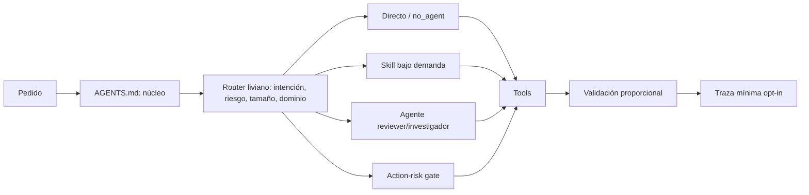

# Arquitectura objetivo

## Decisión

Usar un núcleo canónico pequeño, un manifest machine-readable y progressive disclosure nativo. No crear un “framework de agentes” adicional: el runtime sigue siendo el agente del proveedor; el repo solo aporta políticas, componentes recuperables y checks deterministas.

Hay exactamente dos fuentes editables y sus responsabilidades no se superponen:

1. `AGENTS.md`, escrito a mano, contiene política humana estable y precedencia.
2. `system.manifest.json`, escrito a mano y validado, contiene metadata de componentes, rutas, tools, riesgos y versiones.

El manifest genera registry, catálogos, documentación tabular y adapters de proveedor; nunca genera `AGENTS.md`. Todo archivo generado lleva cabecera y CI rechaza edición manual o drift.

“Sin framework adicional” tiene un presupuesto verificable: un manifest, una función pura de routing y un validador. No se agrega daemon, servicio, base de datos, RAG, scheduler ni segundo runtime. La telemetría opcional es una línea JSON local por decisión y puede desactivarse.



## Principios que permanecen

1. Chat-first: el usuario describe el objetivo, no el nombre del workflow.
2. Menor proceso suficiente.
3. Lecturas y cambios locales reversibles continúan automáticamente.
4. Side effects sensibles piden confirmación justo antes de ejecutarse.
5. Evidencia proporcional antes de afirmar un resultado.
6. Skills y referencias se cargan bajo demanda.
7. Archive no participa del runtime.
8. Cada regla durable tiene owner, mecanismo y test o evidencia.

## Carga progresiva

### Nivel 1 — Núcleo global

`AGENTS.md`, objetivo aproximado 700-1.200 tokens:

- identidad comunicacional mínima, si es personal;
- chat-first;
- escala small/medium/large/high-risk;
- action-risk gate;
- scope y preservación de cambios;
- validación proporcional;
- pointer al manifest/router;
- reglas Git verdaderamente duras.

No contiene listados exhaustivos, claims temporales, modelos concretos, tutoriales, escenarios ni catálogos MCP.

### Nivel 2 — Routing liviano

El router lee solo metadata del manifest:

```json
{
  "id": "researcher",
  "kind": "agent",
  "status": "active",
  "triggers": ["información temporal", "comparación actual", "documentación oficial"],
  "negativeTriggers": ["explicar un archivo local"],
  "mode": "reviewer",
  "access": "read_only",
  "capabilities": ["web", "citations"],
  "actionRisk": "low",
  "exit": "claims dated and cited"
}
```

Precedencia:

1. Instrucción explícita válida del usuario para elegir tarea o especialista.
2. Gate de riesgo de la operación, que ninguna mención explícita puede saltear.
3. Tipo de trabajo: answer/read/change/build/review/research.
4. Dominio, solo si cambia tools, quality gate u output.
5. Tamaño e incertidumbre.
6. `no_agent` para respuesta, inspección o cambio trivial.

### Nivel 3 — Instrucciones específicas

Se carga un solo componente principal por defecto:

- skill de dominio para ejecutar;
- agente read-only para independencia o toolset distinto;
- workflow transversal solo si el trigger lo requiere.

Un segundo componente necesita razón explícita: dependencia, independencia de review o action gate.

### Nivel 4 — Referencias opcionales

Playbooks, ejemplos, presets, docs de proveedor, pricing, templates y referencias técnicas viven bajo `references/` del componente. No entran por el solo hecho de activar la skill.

### Nivel 5 — Archive

Fuera de `.agents/` o excluido por manifest. Nunca descubierto, cargado ni referenciado por componentes activos.

## Router objetivo

| Condición | Ruta | Carga | Salida |
|---|---|---|---|
| Respuesta/lectura/trivial local | `no_agent` | núcleo | respuesta o diff + check mínimo |
| Bug o test rojo | executor + `systematic-debugging`; TDD si agrega regresión útil | skill | causa raíz, fix, test/evidencia |
| Feature mediana | executor + plan breve | una skill de dominio | implementación y validación |
| Large/cross-cutting/high-risk | spec + plan | `spec-kit` condicional | spec/plan/tasks verificables |
| Research temporal | researcher | web + citas | claims fechados, fuentes y incertidumbre |
| Security review | security reviewer | threat model + scanner | findings, severidad, mitigación, veredicto |
| UI/landing | `frontend-design` | referencias visuales según brief | UI + browser/visual QA |
| Producto | `product-foundry` | playbook | hipótesis, MVP, señal falsable |
| SEO growth | `seo-geo-growth` | métricas/keywords según acceso | mapa y backlog medible |
| SEO técnico | skill SEO técnico | repo/web | findings/cambios técnicos |
| Examen | tutor skill + `exam-simulator` | material aportado; vault opt-in | evaluación, simulacro, plan |
| External/destructive | ruta normal + action gate | preview/rollback | confirmación y receipt |
| 2+ tareas independientes | dispatch skill | contratos mínimos | outputs integrables |
| Sesión larga/phase change | checkpoint | estado actual | handoff compacto |

La salida de routing debe incluir `routeVersion`, `selected`, `why`, `filesToLoad`, `actionGate`, `exitCriteria` y `fallback`. Esto permite testear la decisión sin ejecutar el trabajo.

## Agentes

Mantener agentes solo cuando la separación de contexto o tools cambia el resultado:

| Agente | `mode` | `access` / tools mínimas | Trigger | Output |
|---|---|---|---|---|
| `researcher` | reviewer | `read_only`; repo + web + citas | información actual/externa | informe fechado y citado |
| `security-reviewer` | reviewer | `read_only`; repo + scanners seguros | seguridad/secretos/permisos | findings priorizados + mitigación |
| `code-reviewer` | reviewer | `read_only`; diff + tests/logs | high-impact/pre-merge/checker | findings o aprobación razonada |

El executor principal es la capacidad nativa del agente, no una persona adicional. Academic tutor, product, growth, AI architecture, frontend, Obsidian y release son skills porque cambian el workflow, no requieren necesariamente un contexto aislado.

IDs canónicos y compatibilidad:

| ID anterior | ID canónico | Retiro del alias |
|---|---|---|
| `agente-researcher` | `researcher` | una release después del switch |
| `agente-security-auditor` | `security-reviewer` | una release después del switch |
| `agente-code-reviewer` | `code-reviewer` | una release después del switch |

No existen otros agentes en el manifest objetivo. Review visual y estrategia de tests son modos/checklists de `code-reviewer`; tutor, frontend, docs y executor principal son skills/capacidad nativa.

Contrato obligatorio:

- `mode: executor|reviewer` y `access: read_only|workspace_write` como enums separados;
- tools compatibles con outputs;
- triggers y negative triggers;
- inputs mínimos;
- output verificable;
- action risk por tool/operación, no por agente;
- exit condition;
- owner y versión.

## Skills

### Core sugeridas

- `systematic-debugging`
- `test-driven-development` condicional
- `verification` como alias del gate único
- `writing-plan` proporcional
- `dispatching-parallel-agents`
- `using-git-worktrees`
- `receiving-code-review`
- `requesting-code-review`
- `token-efficiency-check`

### Dominio sugeridas

- `frontend-design` con referencias `adapt|animate|polish|onboard|optimize|harden` como modos, no 12 triggers hermanos;
- `ai-production-architecture`;
- `seo-geo-growth` y `technical-seo` con frontera explícita;
- `marketing-strategy`, `mcp-adoption`, `content-strategy` y `release` bajo demanda;
- `product-foundry`;
- `obsidian-vault` condicional;
- `academic-tutor` con referencias `active-recall|exam|coding|case|tracker`;
- `client-work`;
- `doc-coauthoring` solo para documentos complejos;
- adapters de stack (`astro`, `next`, `python`) breves;
- `skill-creator` y `writing-skills` movidas a mantenimiento.

Las descripciones deben ser breves, mutuamente distinguibles y contener negative triggers. Codex limita el catálogo inicial de skills y usa progressive disclosure; esto está documentado en [Build skills](https://learn.chatgpt.com/docs/build-skills.md).

## Workflows transversales

Solo cuatro conceptos globales:

1. `route`: decisión descrita por manifest + código testeado.
2. `action-risk`: gate universal de side effects.
3. `validate`: evidencia proporcional.
4. `checkpoint`: continuidad condicional.

Paralelismo, worktrees, TDD, specs y domains son skills. De este modo un workflow transversal no compite con una skill que implementa lo mismo.

## Action-risk gate

| Acción | Default |
|---|---|
| Leer/buscar/analizar | allow |
| Editar dentro del scope | allow |
| Tests/build/lint local | allow |
| Commit/push solicitado o policy explícita | allow con diff/secrets gate |
| Instalar dependencia/plugin/MCP | ask |
| Borrar/mover destructivamente | ask |
| Producción/migración/pagos/ads/DM/email | ask |
| Marcar revisión humana | deny hasta confirmación humana |

Justo antes de `ask`, presentar: target, payload/acción, blast radius, rollback y evidencia previa. El gate no bloquea investigación local previa.

Una policy explícita del usuario como “push obligatorio” preautoriza el push de la rama de trabajo, pero no autoriza merge, force-push, scope extra ni omitir diff/secret/branch checks.

## Definiciones operativas

| Término | Regla medible |
|---|---|
| `small` | Un dominio, hasta 3 archivos y validación focalizada; no cambia contrato público ni permisos. |
| `medium` | 4-10 archivos o más de un componente coherente; plan breve en conversación. |
| `large` | Más de 10 archivos, migración, contrato público o cambio cross-cutting; spec y plan versionados. |
| `high-risk` | Puede perder datos, exponer secretos, cambiar permisos, producción, pagos o comunicación externa. |
| `high-impact` | Cambia API pública, auth, datos persistentes, build/release o comportamiento usado por múltiples consumidores. |
| `independent` | Tiene inputs/outputs y archivos disjuntos; puede validarse sin esperar otro chunk. |
| `managed path` | Archivo listado en install manifest con hash/base/owner; el updater no toca otros paths. |
| `explicitOnly` | Solo se selecciona por pedido inequívoco del usuario o ID exacto; no por keyword incidental. |
| `fallback` | `no_agent` salvo que falten tools/capacidad; nunca archive ni principal ceremonial. |
| `human-claim` | Estado que afirma revisión/aprobación humana; solo una confirmación humana puede establecerlo. |
| `external-write` | Toda mutación fuera del workspace local: APIs, repos remotos, issues/comentarios, Drive/Notion, uploads, mensajes, deploys o cambios de servicio. Default `ask`; el pedido inicial autoriza preparar, pero no ejecutar. Solo una confirmación posterior al preview exacto satisface el gate, salvo el carve-out específico de commit/push. |

## Memoria

```text
.agents/memory/
├── policy.md              # qué puede convertirse en memoria
├── lessons.md             # pocas reglas durables, con evidencia/owner/fecha
└── adapters/              # contexto personal o de proyecto, no global
```

- No leer toda la memoria al inicio.
- Recuperar por trigger o scope.
- Promoción requiere evidencia repetida o confirmación humana.
- Cada entrada tiene `status`, `lastValidated`, `source` y `supersedes`.
- Checkpoints son estado de tarea, no reglas durables.

## Adapters por proveedor

El manifest genera adapters; no se editan a mano.

| Proveedor | Adapter objetivo |
|---|---|
| Codex | `AGENTS.md` hand-authored + `.codex/config.toml`/metadata generada. El generador referencia pero jamás sobrescribe `AGENTS.md`. Codex concatena guidance global→root→cwd y el más cercano gana: [docs oficiales](https://learn.chatgpt.com/docs/agent-configuration/agents-md.md). |
| Claude Code | `CLAUDE.md` con `@AGENTS.md`; `.claude/agents`/skills solo para capabilities Claude. |
| OpenCode | `opencode.json` validado por CLI; `instructions` solo si añade archivos que OpenCode no descubre. |
| Cursor | `.cursor/rules/*.mdc` generado; User Rules documentadas como paso manual. |
| Gemini/Antigravity | Adapter limitado a behavior oficialmente demostrado; no inferir migración de skills. |
| Devin/Windsurf | Reglas propias del cliente; ACP no implica contexto compartido automáticamente. |
| Aider | `.aider.conf.yml` a `AGENTS.md`. |
| Copilot/Zed | Adapter separado y testeado; si no hay test, status `experimental`. |

Cada adapter declara `provider`, `minVersion`, `sourceDocs`, `generatedFrom`, `lastVerified` y un comando de diagnóstico.

## Validación

Un único comando, por ejemplo `bin/validate-system`, ejecuta:

1. Parse/syntax de JSON, YAML/frontmatter, PowerShell, shell y scripts relevantes.
2. JSON Schema real para manifest, registry y tasks.
3. Grafo: toda referencia activa resuelve activa; archive tiene cero inbound refs activas.
4. Contratos: tools compatibles con outputs/mode.
5. Reachability: todo agente/skill activo tiene trigger o es explicit-only.
6. Routing fixtures: 24 IDs normativos (14 positivos + 10 negativos), español/inglés y menciones explícitas.
7. Adapter checks: `opencode debug config`, Claude import lint, path checks y generated-diff limpio.
8. Context budget: núcleo y metadata bajo límites definidos; reportar, no inventar impacto.
9. Secrets scan.
10. Drift: docs/tablas generadas coinciden con manifest.

CI debe correr el mismo comando en Windows y Linux, con skips explícitos que no se presenten como pass.

## Observabilidad

Log local opt-in, sin prompt completo ni datos personales:

```json
{
  "routeVersion": 2,
  "taskKind": "bugfix",
  "selected": ["systematic-debugging"],
  "loaded": ["AGENTS.md", ".../SKILL.md"],
  "actionGate": "allow",
  "outcome": "validated",
  "correction": null,
  "durationMs": 42000
}
```

Métricas útiles:

- tasa de corrección de routing;
- componentes nunca usados en 90 días;
- pasos/turnos hasta outcome;
- fallos de adapter;
- tasks con aprobación innecesaria;
- costo/contexto observado si el proveedor lo expone;
- A/B de una instrucción costosa contra baseline.

## Deprecación

Estados:

```text
active → deprecated → archived → removed
```

Reglas:

- `deprecated` tiene reemplazo y fecha límite.
- Antes de archivar: inbound active refs = 0, fixtures migrados, docs generadas.
- Archive no vive en paths descubiertos por el runtime.
- Componentes sin uso 90 días se revisan; no se borran solo por edad.
- Revertir restaura manifest + componente + fixtures en un commit atómico.

## Árbol propuesto

```text
agents-system/
├── AGENTS.md
├── system.manifest.json
├── schemas/
│   ├── manifest.schema.json
│   ├── component.schema.json
│   └── task.schema.json
├── .agents/
│   ├── agents/
│   │   ├── researcher.md
│   │   ├── security-reviewer.md
│   │   └── code-reviewer.md
│   ├── skills/
│   │   ├── systematic-debugging/
│   │   ├── writing-plan/
│   │   ├── frontend-design/
│   │   │   └── references/
│   │   ├── academic-tutor/
│   │   │   └── references/
│   │   ├── product-foundry/
│   │   ├── seo-geo-growth/
│   │   ├── ai-production-architecture/
│   │   └── ...
│   ├── workflows/
│   │   ├── action-risk.md
│   │   ├── validation.md
│   │   └── checkpoint.md
│   └── memory/
│       ├── policy.md
│       ├── lessons.md
│       └── adapters/
├── adapters/
│   ├── codex/
│   ├── claude/
│   ├── opencode/
│   ├── cursor/
│   └── experimental/
├── routing/
│   ├── route.ps1
│   └── fixtures/
├── bin/
│   ├── validate-system.ps1
│   ├── install.ps1
│   └── update.ps1
├── docs/
│   ├── architecture.md
│   ├── providers.generated.md
│   └── components.generated.md
└── archive-manifest.json
```

El archive pesado puede vivir en una branch/tag o repo de artefactos; `archive-manifest.json` conserva origen, licencia, hash y reemplazo sin mantenerlo en el camino crítico.
