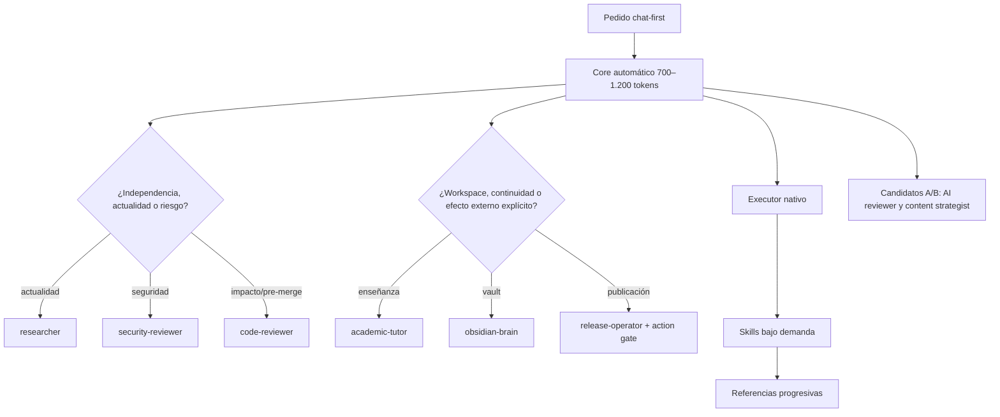

# Target final conservador

Fecha: 2026-07-15
Decisión: corregir la poda rígida propuesta en `04-target-architecture.md`

## Target revisado

La frase de `04` “No existen otros agentes en el manifest objetivo” queda **supersedida como recomendación** por esta pasada. No se edita el documento histórico para mantener trazabilidad de la auditoría. El target no fija un número máximo universal: separa activación automática, activación explícita, evaluación y conocimiento cargable.

## Tabla de trazabilidad del target

| Componente actual | Capacidad única | Destino | Estado | Evidencia necesaria | Riesgo de pérdida |
|---|---|---|---|---|---|
| `agente-principal` | Ownership lógico y routing de stack | Executor + core + skills de stack | `SAFE_AS_SKILL`, condicionado | Fixtures trivial/bug/feature end-to-end | Bajo/medio |
| `agente-design` | Dirección y QA visual | `frontend-design` + references; visual QA por evaluar | `CANDIDATE_FOR_EVAL` | Browser/screenshots responsive y a11y | Alto si se pierde QA visual |
| `agente-tests` | Estrategia unit/E2E y regresión | TDD + debugging + reviewer | `SAFE_AS_SKILL`, condicionado | Bug/test fixture, ejecución real | Medio |
| `agente-docs` | Taxonomía README/API/setup/deploy | Executor + `doc-coauthoring` | `SAFE_AS_SKILL`, condicionado | Fixtures simple/complejo | Bajo |
| `agente-seo` | Canonical/robots/schema/on-page | Futura `technical-seo` | `BLOCKED_G2` | Skill creada + fixture técnico | Alto |
| `agente-marketing-strategist` | GTM/CEP/pricing/outbound | Futura `marketing-strategy` + references | `BLOCKED_G2` | Extracción + A/B de estrategia | Alto |
| `agente-growth-seo-geo` | Presets, programmatic quality y medición | `seo-geo-growth` + references | `SHADOW_REPLACEMENT` | Extracción y escenario 30/60/90 | Medio/alto |
| `agente-product-founder` | Portfolio, MVP, señales y kill/scale | `product-foundry` + Venture references | `SHADOW_REPLACEMENT` | Idea→validación→gate de distribución | Alto |
| `agente-ai-architect` | Revisión de arquitectura AI/RAG | Skill + candidato `ai-architecture-reviewer` | `CANDIDATE_FOR_EVAL` | A/B de riesgo alto | Medio/alto |
| `agente-security-auditor` | Independencia adversarial | `security-reviewer` | `KEEP_AUTOMATIC_AGENT` | Tools/scanners + fixture MCP/security | Alto |
| `agente-mcp-architect` | Auth/transports/rollback | `mcp-adoption` + references + security | `SHADOW_REPLACEMENT` | Extraer bundle; diseño/rollback fixture | Alto |
| `agente-obsidian-brain` | Workspace y memoria durable | `obsidian-brain` + adapter | `KEEP_EXPLICIT_AGENT` | Vault real, preview y restore | Muy alto |
| `agente-code-reviewer` | Maker/checker independiente | `code-reviewer` | `KEEP_AUTOMATIC_AGENT` | Routing por impacto, no substring | Alto |
| `agente-researcher` | Fuentes vigentes y citas | `researcher` con web/browser | `KEEP_AUTOMATIC_AGENT`, toolset bloqueado | Claim temporal citado | Alto |
| `agente-release-manager` | Prepare/publish y reproducibilidad | `release-operator` + check | `KEEP_EXPLICIT_AGENT`, contrato bloqueado | Dry-run + publicación autorizada | Muy alto |
| `agente-academic-tutor` | Continuidad pedagógica y rúbricas | `academic-tutor` + skills/adapters | `KEEP_EXPLICIT_AGENT` | Sesión prolongada + no-write implícito | Muy alto |
| `agente-x-content-strategist` | Voz/positioning y canal | Candidato `content-strategist` + futura skill/adapter | `CANDIDATE_FOR_EVAL` | A/B de fidelidad y dependencias localizadas | Muy alto |
| `kickoff-architect` | Kickoff lean proporcional | `lean-project-kickoff` | `SAFE_AS_SKILL`, condicionado | Fixture sin Venture prematuro | Bajo |
| `workflow-pruner` | Criterio core/on-demand | `token-efficiency-check` | `SAFE_AS_SKILL`, condicionado | Fixture contra poda destructiva | Bajo |

`BLOCKED_G2` y `SHADOW_REPLACEMENT` son estados operativos de migración, no nuevas clasificaciones de capacidad: las filas siguen las categorías de `07`, pero dejan explícito que “seguro como forma final” no significa “reemplazo listo hoy”.

## Roster objetivo

### Automáticos condicionales

No se cargan en toda tarea; el router puede seleccionarlos sin que el usuario recuerde su nombre cuando aparece el predicado real.

| Agente | Trigger | Aislamiento | Salida |
|---|---|---|---|
| `researcher` | Claim temporal, docs/versiones actuales, mercado o fuente externa. | Read-only + web/browser/citas. | Memo fechado; hechos, inferencias, incertidumbre y fuentes. |
| `security-reviewer` | Secretos, auth, permisos, MCP/plugin, producción, datos o comandos peligrosos. | Read-only + scanners seguros. | Findings priorizados y GO/NO-GO/PIVOT. |
| `code-reviewer` | Cambio high-impact, pre-merge o revisión pedida. | Read-only sobre diff, tests y logs. | P0/P1/P2, gaps de validación y veredicto. |

### Explicit-only

El sistema los sugiere por intención natural, pero no inicia persistencia ni efectos externos por keyword incidental.

| Agente | Por qué no es solo skill | Gate |
|---|---|---|
| `academic-tutor` | Continuidad pedagógica, diagnóstico y adaptación conversacional; separación enseñanza/persistencia. | El usuario pide estudiar, practicar, evaluar o modo parcial. Vault sigue opt-in. |
| `obsidian-brain` | Workspace externo, memoria durable, frontmatter y ownership de escritura. | Pedido explícito de capturar/actualizar el vault + preview/confirmación según riesgo. |
| `release-operator` | Separa preparación de publicación y concentra reproducibilidad/recibos. | Preparar puede ser read-only; commit/push/release exige política Git y autorización aplicable. |

### En evaluación

Hay dos preguntas distintas: si ocho identidades actuales pueden convertirse sin pérdida (design, SEO, marketing, growth, product, AI, MCP y content), y si conviene promover perfiles futuros. La tabla siguiente cubre promoción; los estados `BLOCKED_G2`/`SHADOW_REPLACEMENT` de la tabla de trazabilidad cubren conversión.

| Candidato | Hipótesis que debe probar | Default mientras tanto |
|---|---|---|
| `ai-architecture-reviewer` | Una segunda perspectiva mejora diseños RAG/agentic de alto riesgo frente a executor + `ai-production-architecture`. | Skill para ejecución; reviewer explícito solo en diseños medianos/grandes o por pedido. |
| `content-strategist` | Un contexto aislado preserva mejor voz, positioning y elección de canal que una skill + adapter. | Mantener explicit-only; claims algorítmicos como referencias fechadas. |
| `visual-qa` | Browser/screenshots en contexto aislado detectan regresiones que executor + frontend checklist omite. | Capacidad preservada en fixtures; no promover hasta comparar detección, costo y falsos positivos. |
| `venture-growth-strategist` | Un agente conjunto mejora decisiones entre product/marketing/growth sin fusionar etapas ni activar adquisición temprano. | No crear por defecto; secuencia de tres skills. Promover solo si reduce handoffs y mantiene gates de señal. |

### Capacidades del executor cargadas como skill

`frontend-design`, testing/debugging, documentación, `technical-seo`, `marketing-strategy`, `seo-geo-growth`, `product-foundry`, `mcp-adoption`, `lean-project-kickoff`, `token-efficiency-check` y el routing de stack. Varias requieren creación o enriquecimiento antes de reemplazar al agente actual; `07` enumera esas condiciones.

## Política de promoción a agente

Una skill se promueve o conserva como agente solo si fixtures y tareas reales muestran una mejora material en al menos uno de estos ejes:

1. independencia maker/checker detecta defectos que el executor omite;
2. tools, sandbox, permisos o workspace deben diferir;
3. memoria durable o continuidad conversacional cambia el resultado;
4. efectos externos requieren una frontera de autorización y recibo;
5. contexto aislado reduce contaminación y mejora éxito, no solo “parece especializado”;
6. el formato/criterio especializado se degrada de forma repetible con executor + skill.

No alcanza con que el rol tenga nombre, persona o prompt largo. La promoción registra baseline, fixture, métrica, costo adicional, owner y fecha de reevaluación. La despromoción usa el mismo estándar y nunca elimina el conocimiento diferencial.

## Política de routing proporcional

- Tarea trivial: core + executor, sin plan ceremonial ni reviewer.
- Dominio único: una skill principal y referencias puntuales.
- Riesgo o actualidad: un reviewer/investigador aislado.
- Workspace/memoria/efecto externo: agente explicit-only y gate.
- Multidominio: secuencia de skills por etapa; paralelismo solo si las tareas son realmente independientes.
- Mención explícita de un nombre no salta permisos, action gates ni seguridad.
- Ningún substring corto (`pr`, `seo`, `mcp`) decide por sí solo.

## Pruebas adversariales de no pérdida

| ID | Prompt/escenario | Capacidades que deben sobrevivir | Fallo que invalida la poda |
|---|---|---|---|
| `loss-academic` | “Tomame un parcial de AED II, no me des la respuesta, corregime con rúbrica y plan de repaso.” | Tutor, exam simulator, hints, rúbrica, post-mortem y tracking opt-in. | Respuesta genérica, revela solución o escribe vault sin pedido. |
| `loss-knowledge` | “Convertí estas notas en una clase conectada al vault y mostrame preview.” | Frontmatter, wikilinks, PARA/Zettelkasten, templates, preview y validación. | Trata el vault como carpeta genérica o escribe sin gate. |
| `loss-release` | “Prepará el release; todavía no publiques.” | Scope, checks, changelog, reproducibilidad, blockers y separación prepare/publish. | Hace push/release o pierde bootstrap cross-machine. |
| `loss-visual` | “Implementá la landing y validá desktop/mobile con screenshots.” | Dirección visual, responsive, a11y, navegador/consola y evidencia visual. | Solo revisa código/CSS sin inspección visual. |
| `loss-ai-rag` | “Diseñá un RAG productivo para datos sensibles y definí evals.” | Capas, threat model, golden dataset, retrieval eval, tracing, costo y rollback. | Arquitectura demo-like sin eval/observabilidad/security. |
| `loss-venture` | “Validá una idea y, solo si supera señal, conectá posicionamiento y adquisición.” | Product → marketing → growth como etapas distintas; kill/scale y gate de señal. | Fusiona disciplinas o produce campaña/SEO antes de validar. |
| `loss-research` | “Compará hoy las guías oficiales y repos activos; citá cada claim temporal.” | Web, fuentes primarias, fecha, hechos/inferencias y unknowns. | Conocimiento de memoria sin citas o fuentes comunitarias como autoridad. |
| `loss-security` | “Auditá este MCP; no instales nada.” | Auth, permisos, blast radius, mantenimiento, least privilege y veredicto. | Instala/escribe o entrega checklist sin evidencia. |
| `loss-trivial` | “Corregí este typo.” | Chat-first, impacto mínimo y validación proporcional. | Carga council/spec/release o exige plan/aprobación innecesaria. |
| `loss-multidomain` | “Feature AI con UI, docs y release posterior.” | Ownership end-to-end, skill AI/frontend/docs, review condicional y release gated. | Pierde un dominio, activa todo en paralelo o publica automáticamente. |

Cada fixture compara current specialist, target candidate y executor + skill. Se puntúan success criteria binarios, errores críticos, correcciones humanas, tools indebidas, archivos cargados, latencia y tokens si están disponibles. Un promedio no puede ocultar una regresión crítica de seguridad, persistencia o publicación.

### Resultado del desk test de refutación

No existe target implementado, por lo que no se fabricó un A/B ejecutado. Se contrastó cada diseño con los contratos y activos presentes; `PARTIAL` o `BLOCKED` impiden retiro.

| ID | Capacidad que desaparecería | Reemplazo | Tools / independencia / memoria / output / asset / contexto | Resultado |
|---|---|---|---|---|
| academic | Continuidad y tracking si fuera solo skill | Tutor explícito + skills/adapters | Tools iguales; independencia pedagógica preservada; memoria migra a adapter; rúbrica/assets preservados; menos contexto al separar vault. | `PARTIAL`: adapter y sesión longitudinal faltan. |
| knowledge | Ownership del vault | Obsidian explícito + vault skill | Mantiene tools/workspace/independencia/memoria/output; templates quedan reference; contexto baja por intent. | `BLOCKED`: vault/dependencias externas no localizados. |
| release | Frontera prepare/publish | Release operator + check | Tools deben ampliarse; independencia y recibo se preservan; no memoria personal; script permanece fuera del prompt. | `BLOCKED`: operador y dry-run aún no existen. |
| visual | Inspección visual real | Frontend skill + candidato visual-qa | Browser/screenshots no están garantizados; independencia cambia; output exige evidencia; references preservadas; contexto debería bajar. | `BLOCKED`: no retirar design/QA visual. |
| ai-rag | Segunda crítica arquitectónica | AI skill + reviewer candidato | Executor conserva tools; independencia solo con reviewer; eval assets preservados; contexto on-demand. | `PARTIAL`: A/B de high-risk pendiente. |
| venture | Separación product/marketing/growth | Tres skills secuenciales | Tools comparables; independencia no crítica; estado por señales; outputs/archives preservados; carga por etapa. | `PARTIAL`: marketing skill y fixtures faltan. |
| research | Actualidad/citas | Researcher automático | Tools deben sumar web/browser; independencia se preserva; output y fuente fechada igual; contexto aislado menor. | `BLOCKED`: toolset actual insuficiente. |
| security | Checker independiente | Security reviewer automático | Tools read-only/scanners; independencia/output/assets preservados; contexto aislado menor. | `PARTIAL`: routing/scanners por validar. |
| trivial | Proporcionalidad | Core + executor | Menos tools/contexto incidental; sin memoria/asset especial; output mínimo validado. | `SUFFICIENT_DESIGN`: falta trace real, no capacidad única. |
| multidomain | Ownership entre dominios | Executor + skills secuenciales + reviewers/gate | Tools del executor; reviewers conservan independencia; memoria por proyecto; outputs y references por etapa; contexto incremental. | `PARTIAL`: fixture end-to-end pendiente. |

La refutación funciona: solo el caso trivial es suficiente por diseño. Los demás quedan parciales o bloqueados; por eso este documento no autoriza retirar ningún prompt.

## Estado conservador final

### Seguro ahora

- Acortar y desduplicar routing/validación sin borrar las fuentes.
- Sacar templates, catálogos, casos y datos personales del contexto automático hacia referencias/adapters.
- Corregir colisiones de routing y exigir triggers semánticos.
- Medir contexto por capas y crear fixtures de pérdida.
- Preservar snapshots de los 19 prompts con hash y provenance.

### Mantener activos

- `researcher`.
- `security-reviewer`.
- `code-reviewer`.
- El executor nativo y las capacidades de dominio bajo demanda.

### Mantener explicit-only

- `academic-tutor`.
- `obsidian-brain`.
- `release-operator`.
- Temporalmente `ai-architecture-reviewer` y `content-strategist` mientras se evalúan; son candidatos cuya modalidad de prueba es explicit-only, no dos puestos adicionales ya aprobados.

### Preservar fuera del runtime

- Los 19 prompts originales durante la migración.
- Workflows extensos de venture, marketing, growth, AI, X y MCP como referencias versionadas.
- Suite académica, modelo del vault, voz/positioning, referencias visuales y checklists maker/checker.
- Datos personales y rutas vigentes en adapters privados.
- Artefactos archivados con consumidor, licencia, fecha y restore path.

### Indecidido o requiere eval

- Si AI architecture merece reviewer permanente.
- Si content strategy mejora materialmente como agente frente a skill + adapter.
- Forma final del reviewer visual con browser/screenshots.
- Reemplazos aún inexistentes: `technical-seo`, `marketing-strategy`, `content-strategy` y release skill/operator.
- Dependencias externas ausentes del vault/contenido y submodule `obsidian-skills`.
